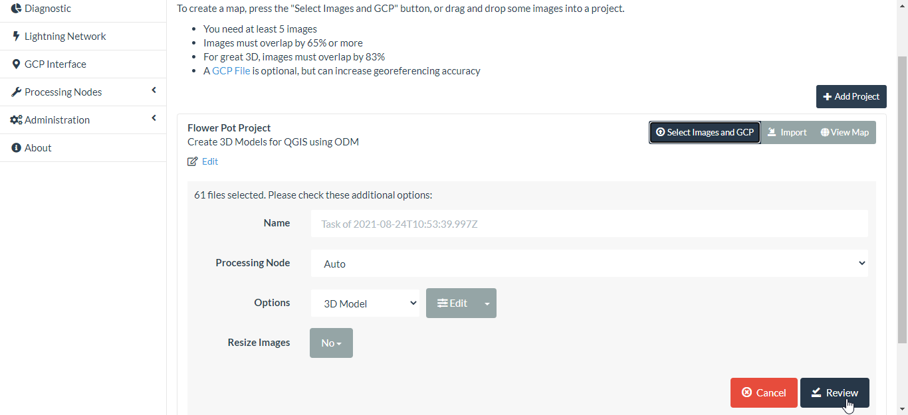
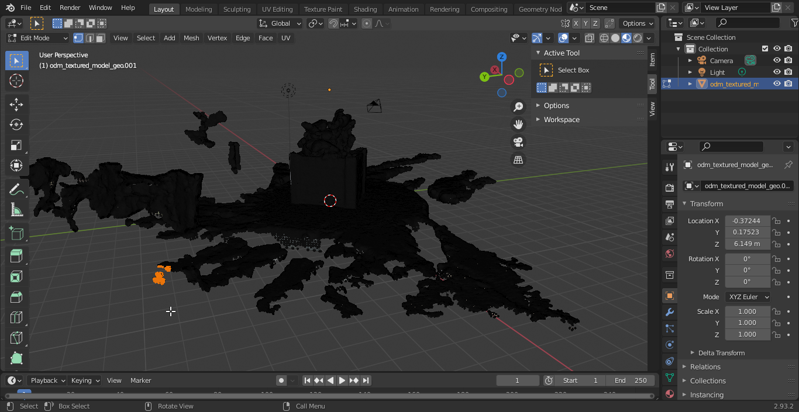
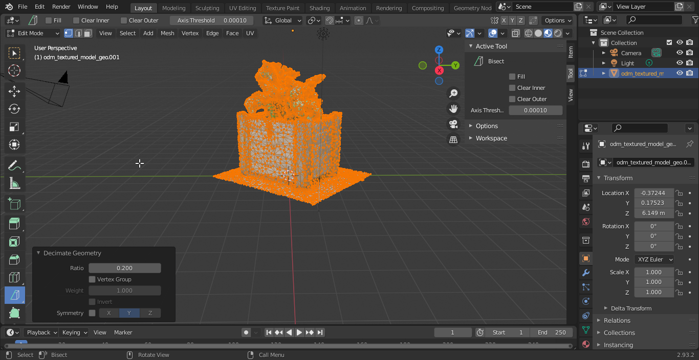

# Creating 3D models for QGIS with ODM (for Windows)

This post is adapted from [Creating 3D Models for QGIS With ODM by Tim Sutton](https://gist.github.com/timlinux/95bd137154326aab43cf91291e285527)

## Required Software

* [ffmpeg](https://www.ffmpeg.org/download.html#build-windows)
* [ImageMagick](https://imagemagick.org/script/download.php#windows)
* [Blender](https://www.blender.org/download/)
* [QGIS](https://qgis.org/en/site/forusers/download.html)
* [OpenDroneMap WebODM](https://www.opendronemap.org/webodm/download/) or  [OpenDroneMap ODM  command line toolkit](https://hub.docker.com/r/opendronemap/odm)

### Configuring ffmpeg

The ffmpeg Windows executable file was obtained from the [FFmpeg-Builds](https://github.com/BtbN/FFmpeg-Builds/releases) repository by BtbN.

Unzip the .zip file into your desired location then add the directory path (directory means exclude the file name from path) of the ```ffmpeg.exe``` to your System variables path variable in the System environment variables [[1]](#1).

### Configuring ImageMagick

Due to the [ImageMagick Convert issue](https://legacy.imagemagick.org/Usage/windows/#why) a simple recommended solution is to [rename](http://savage.net.au/ImageMagick/html/install-convert.html) the ImageMagick convert.exe to, say, im-convert.exe.

### Configuring OpenDroneMap WebODM (User Interface)

WebODM is a web interface and API to OpenDroneMap. To manually install WebODM, go to [GitHub](https://github.com/OpenDroneMap/WebODM/), get a copy of the source code and follow the [README](https://github.com/OpenDroneMap/WebODM/blob/master/README.md).

### Configuring OpenDroneMap ODM (command line)

ODM is the OpenDroneMap's open source command line toolkit. This toolkit requires that you have [Docker](https://www.docker.com/products) installed. To use this toolkit see the [ODM Quickstart](https://github.com/OpenDroneMap/ODM#quickstart).

## Extract the video frames

Create a new folder that will be your working directory and put the video into the empty folder. Use ffmpeg to extract the frames. You can experiment with different frame rates but generally there will be little value in extracting at 60fps or whatever your phone natively shoots at.

**Note**: When shooting the video with your phone, ensure the entire object fits in the video frame through out the video.

For this demo the video's properties were:

* length: 1 minute 1 second
* frame width: 1920
* frame height: 1080
* data rate: 17035kps
* total bitrate: 17131 kbps
* frame rate:  29.95 frames/second (fps)

Open the Windows Command Prompt and change the working directory using the command ```cd``` to where the video file is located (your working directory). Execute the command below to extract the frames (images) from the video at 1 frames/second (fps) [[2]](#2).

```
#  Output one image every second, named out0000001.jpg, out0000002.jpg, out0000003.jpg, etc.
# The %07d dictates that the ordinal number of each output image will be formatted using 7 digits.

ffmpeg.exe -i FlowerPotVideo.mp4 -vf fps=1 -f image2 image-%07d.png
```

*Video taken at Two Rivers Mall, Nairobi, Kenya*. 

For interest,  you can generate the above GIF from the extracted frames using this ImageMagick command:

```
im-convert.exe *.PNG FlowerPot.gif
im-convert.exe FlowerPot.gif -scale 25% FlowerPotSmall.gif
```

## ODM Processing

### Way one: using Web ODM

The exported ```.png``` images can now be imported into WebODM. Use the steps below to create a project and then load the images in WebODM:

1. Create a new project in WebODM using the Add project button. Name the project and add an optional project description.


2. Upload the ```.png```  images into WebODM.


3. Ran the WebODM processing using the following settings.



The above steps only process the 3D model using the images in their original resolution. You may want to play around with this depending on how detailed you want the 3D model.

### Way two: using ODM command line

This way just uses straight ODM from a docker container and is probably easier and more reliable than using WebODM as shown above.

Place your video frame images from the previous step in a subfolder of your current working directory (e.g. here I put them in the FlowerPot/images subfolder):

```
FlowerPot
├── images
│   ├── image-0000001.png
│   ├── image-0000002.png
│   ├── image-0000003.png
│   ├── image-0000004.png
│   ├── image-0000005.png
│   ├── image-0000006.png
│   ├── image-0000007.png
│   ├── image-0000008.png
│   ├── image-0000009.png
│   ├── image-0000010.png
│   ├── image-0000011.png
│   ├── image-0000012.png
│   ├── image-0000013.png
│   ├── image-0000014.png
│   ├── image-0000015.png
│   ├── image-0000016.png
│   ├── image-0000017.png
│   ├── image-0000018.png
│   ├── image-0000019.png
│   ├── image-0000020.png
│   ├── image-0000021.png
│   ├── image-0000022.png
│   ├── image-0000023.png
│   ├── image-0000024.png
│   ├── image-0000025.png
│   ├── image-0000026.png
│   ├── image-0000027.png
│   ├── image-0000028.png
│   ├── image-0000029.png
│   ├── image-0000030.png
│   ├── image-0000031.png
│   ├── image-0000032.png
│   ├── image-0000033.png
│   ├── image-0000034.png
│   ├── image-0000035.png
│   ├── image-0000036.png
│   ├── image-0000037.png
│   ├── image-0000038.png
│   ├── image-0000039.png
│   ├── image-0000040.png
│   ├── image-0000041.png
│   ├── image-0000042.png
│   ├── image-0000043.png
│   ├── image-0000044.png
│   ├── image-0000045.png
│   ├── image-0000046.png
│   ├── image-0000047.png
│   ├── image-0000048.png
│   ├── image-0000049.png
│   ├── image-0000050.png
│   ├── image-0000051.png
│   ├── image-0000052.png
│   ├── image-0000053.png
│   ├── image-0000054.png
│   ├── image-0000055.png
│   ├── image-0000056.png
│   ├── image-0000057.png
│   ├── image-0000058.png
│   ├── image-0000059.png
│   ├── image-0000060.png
│   └── image-0000061.png
├── FlowerPot.gif
├── FlowerPotSmall.gif
└── FlowerPotVideo.mp4
````

Then run this docker command:

```
docker run -ti --rm -v "pwd":/datasets opendronemap/odm --project-path /datasets FlowerPot
````

The pwd is the absolute path of the parent directory to the current working directory (FlowerPot).


## Blender

If you used the ODM processing steps outlined in [Way one](#way-one-using-web-odm), after processing, download the assets for the textured model as shown below:


Move the ```textured_model.zip``` file into your working directory and unzip it. The Wavefront OBJ file to be imported into Blender is the ```textured_model/odm_textured_model_geo.obj```.

If you used the ODM processing steps outlined in [Way two](#way-two-using-odm-command-line), the Wavefront OBJ file to be inported into Blender is the ```odm_texturing/odm_textured_model_geo.obj```

Next, fire up Blender, create a new General project, delete the default block and import the textured model Wavefront OBJ file:


Make sure to select the geo object file:


After enabling Viewport Shading mode, you should see your model loaded (may take a while to load depending on complexity). As you can see, my model came in lying on it's side.


Use the Transform panel in the Sidebar region of Blender to numerically control the position, rotation, and other properties of your model so the axes are correctly orientated. You can also do this manually by using the keyboard shortcuts:  GKEY, SKEY, and RKEY for translation, scaling and roatation respectively together with the
XKEY,  YKEY,  ZKEY to constrain the translation, scaling or rotation  movement to the X,  Y or Z axis of the  global  reference respectively. For further information on the Blender keyboard shortcuts see the [Blender HotKeys In-depth Reference](https://download.blender.org/documentation/BlenderHotkeyReference.pdf).


Edit the model, removing all the unwanted stuff around your object. There are several ways to do this depending on the complexity of your model.

### Remove the unwanted objects around model: Way 1

Put Blender into Edit mode (first select the imported object so it goes orange):


After putting Blender into edit mode, select everything in the scene while in edit mode (by pressing A), right click, then from the context menu choose 'loose parts'.


Return to object mode and iteratively select and delete the parts you don't want.

### Remove unwanted objects around model: Way 2

After putting Blender in Edit mode, deselect everything.

Select a group of vertices / faces you want to remove.




Press (X) then choose Vertices from the context menu.


You may need to reselect from the same area and delete vertices repeatedly as the selection will not choose vertices that are behind other faces. Keep doing this until you have nothing but your model left.

### Remove the unwanted objects around model: Way 3

This method is the simplest method to work with. The unwanted objects around the model can be removed using the Bisect tool in Blender. A good tutorial on this is the [Split Meshes In Two | Bisect Tool | Blender Quickie](https://www.youtube.com/watch?v=fVOYv8HdMxI).

After putting Blender into edit mode, select everything in the scene using the keyboard shortcut, A, and change your viewpoint so that you have a clear view of the axis you would like to cut along.


In the Blender Toolbar find the Knife tool.


Left click on the Knife tool and hold down the button. Select the Bisect tool from the drop down menu.


Select everything using , A, and draw the bisecting line where you want to cut the model.


From the Bisect tool options select Clear Inner or Clear Outer depending on which part you want to delete.


Repeat the bisection until you have nothing but your model left.


Switch back to View mode, add your texture back on, spin the model around and admire (ahem: quality check) your model. You can export the cleaned up model for back up purposes by writing the model to a Wavefront OBJ file, ```FlowerBox.obj```.Make sure to save the OBJ file in the same folder where your textures are. In this case this will be the ```odm_texturing``` folder.


Next we want to simplify the model as much as possible. QGIS is going to grind to a halt if you ask it to render complex models as symbols so we are going to 'decimate' the geometry such that it maintains it's form but loses as many vertices as possible. You need to jump back into edit mode for this:


In the decimate popup, slide the ratio down below 1 as small as you can make it without destroying the integrity of your model's shape.



If you are lucky you may be able to reduce the model complexity down to 10-15% of the original.

Ok now let's reverse the blender import process and write our model and it's texture to a new OBJ file, ```FlowerBox_0_2.obj```. Make sure to save the OBJ file in the same folder where your textures are. In this case this will be the ```odm_texturing``` folder.

Next hop over to QGIS and make a new project with the OpenStreetMap XYZ layer added and create a scratch point layer with Z value. Make sure to use EPSG:3857 for the project CRS and the new point layer CRS:


Now zoom to your object's location on the OSM map and stick a dot in that location on your point layer:


Make sure to save your edits. Now add a new 3D map view to your project.


Then in your point layer properties, set the 2d symbology to no symbol:


And the 3D symbology to use your new object file:


Now navigate to your model in the 3D map and enjoy the 3D awesomeness of your real world model in QGIS!


## References

<a id="1">[1]</a>“Register” an .exe so you can run it from any command line in Windows. (2011, January 27). Stack Overflow. https://stackoverflow.com/questions/4822400/register-an-exe-so-you-can-run-it-from-any-command-line-in-windows

<a id="2">[2]</a>Parisi, L. (n.d.). Extract all frames from a movie using ffmpeg. Gist. Retrieved August 23, 2021, from https://gist.github.com/loretoparisi/a9277b2eb4425809066c380fed395ab3
